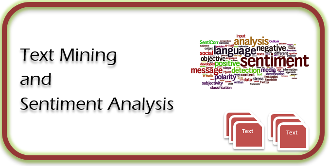

```{r setup, include=FALSE}
options(htmltools.dir.version = FALSE)
xaringanExtra::use_tile_view()
xaringanExtra::use_panelset()
xaringanExtra::use_animate_all("fade")
xaringanExtra::use_scribble()
```


```{r xaringan-themer, include=FALSE, warning=FALSE}
library(xaringanthemer)
style_duo_accent(
  primary_color = "#000000",
  secondary_color = "#495266",
  inverse_header_color = "#F1FC9D"
)
```
class: center

# Hi, greetings from Kaiyang Qin


.center[]

???

my name is Kaiyang Qin and thank you for considering me for this pos doc position.  Please allow me to introduce myself.

---
name: one
## About me


<br>
<br>
<br>

--
.center[I am a social & behavioral science researcher.]


---
## About me


.center[]

---
template: one

--
.center[I am passionate about programming.]


---
## About me

<br>
<br>

.center[]

---
## About me

<br>
<br>

.center[]

---
## About me


.center[]

 
---
template: one

--
.center[I am a fingerstyle player.]


---
## About me


.center[]
---
background-image: url("img/img.png")
## My academic journey


---
background-image: url("img/img1.png")

## My academic journey


---
## My academic journey

<br>

.center[]

--
.center[Environmental control of human goal-directed behavior.]

---
## My academic journey

.panelset[
.panel[.panel-name[ Questions ]

- <span style="font-size:20px">How does such environmental control work (from a learning perspective)?</span>


- <span style="font-size:20px">To what extent this environmental control can be generalized?</span>

]

.panel[.panel-name[ Answers ]

- <span style="font-size:20px">Such environmental control can be built upon basic learning mechanisms.</span>


- <span style="font-size:20px">Such environmental control can even be generalized to more abstract goal pursuit.</span>


]


]


---
## My academic journey

<br>

.center[]

<br>
<br>

--
.center[]

--

.center[What about more general/abstract goals]


---
## My academic journey

.center[]


--
.center[]


---
## Potential directions

--
<br>
<br>
<br>
.center[<span style="font-size:25px">Interested in how the online environment influences (unhealthy) food intake.</span>]

---
## Potential directions


.center[]


---
## Potential directions

<div style="position:center"><video controls>
    <source src="img/eat.mp4" type="video/mp4">
</video></div>

---
## Potential directions


--

- Communication science

> How do viewers see this? Emotion wise?

--

- Psychological science

> Whether viewing videos like this increases their (unhealthy) food intake?

--

- Public health & Political science

> Health warning? How to detect such 'unhealthy' eating promotors?

---
## Teaching

--
.center[]

---
class: center middle
## Thank your for listening...

